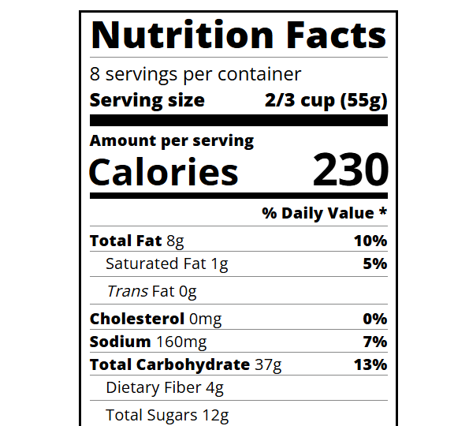

# nutrition-label

A design for a nutrition-label.

**Live-Demo:** [https://oendemann.github.io/nutrition-label/]

---

---

## About The Project

Part of the web design course on freeCodeCamp. This project showcases the basics of making good typography on a website.

---

## Built With

* **HTML:** Used for the structure and majority of the content seen on the webpage.
* **CSS:** Used for much of the small design features (text alignment, text weight, etc).

---

## What I Learned

1. Classes can be used to more easily design a webpage and make the code much more organized.
2. Whitespace can be important in typography, as it can draw attention away or towards specific pieces of a webpage.
3. Classes can be multi-sectioned (e.g. "divider large", "bold small-text", etc).

---

## Acknowledgments

* Project idea and requirements from [freeCodeCamp.org](https://www.freecodecamp.org/)